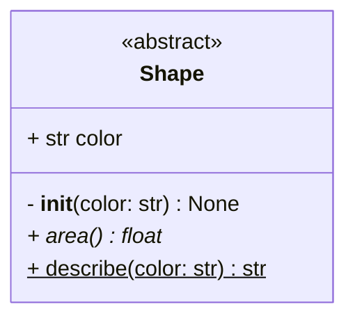

# MermaidGenerator

Automatically generate [Mermaid](https://mermaid.js.org/) class diagrams from Python source code.

[](https://pypi.org/project/mermaidgenerator/)
[](https://pypi.org/project/mermaidgenerator/)
[](LICENSE)

MermaidGenerator parses your Python files using the AST and produces a Markdown file with embedded Mermaid class diagrams — no runtime execution required. [See an example output.](/class_diagrams.md)

**Made by Fabian Gnatzig in 2026.**

---

## Features

- Class attributes with type annotations
- Method signatures including argument types and return types
- Inheritance relationships with links between diagrams
- `@staticmethod` and `@classmethod` — marked with `$`
- `@abstractmethod` — marked with `*`
- `@property` — rendered as a typed attribute, backing field suppressed
- Abstract base classes (`ABC`) — rendered with `<<abstract>>` stereotype
- `@dataclass` and other decorators — rendered as Mermaid stereotypes
- Public (`+`) and private (`-`) visibility based on naming convention
- Union types (`X | Y`), generics (`list[str]`), and qualified types (`typing.Optional`)
- Works on single files or entire project trees

---

## Installation

```bash
pip install mermaidgenerator
```

---

## Usage

```
python -m mermaidgenerator --src-folder <path> [--doc-path <output>]
```

| Argument | Required | Description |
|---|---|---|
| `--src-folder` | yes | Root directory of your Python project to scan |
| `--doc-path` | no | Output path for the `.md` file (default: `<src-folder>/../class_diagrams.md`) |

### Example

```bash
python -m mermaidgenerator --src-folder src --doc-path docs/class_diagrams.md
```

---

## Example output

Given a class like this:

```python
from abc import ABC, abstractmethod

class Shape(ABC):
    """Abstract base class for shapes."""

    def __init__(self, color: str) -> None:
        self.color: str = color

    @abstractmethod
    def area(self) -> float: ...

    @staticmethod
    def describe(color: str) -> str: ...
```

MermaidGenerator produces:

````markdown
# Shape
Abstract base class for shapes.

````
