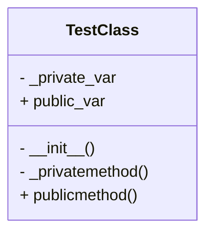
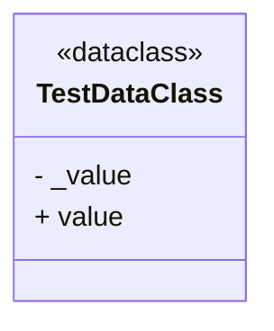

# TestClass
This is a test class.

```mermaid
classDiagram
    class TestClass {
- \_private\_var
+ public_var
- \_\_init\_\_()
- \_privatemethod()
+ publicmethod()
}
```

# TestDataClass
This is a docstring.

```mermaid
classDiagram
    class TestDataClass {
<<dataclass>>
- \_value
+ value
}
```
