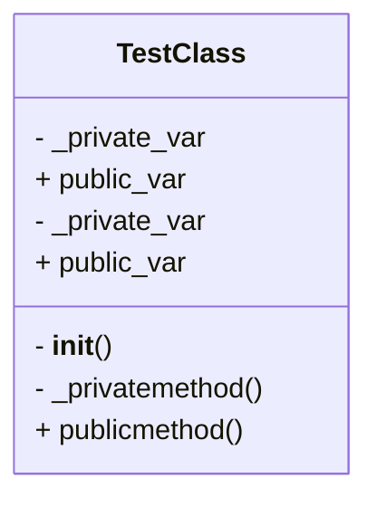
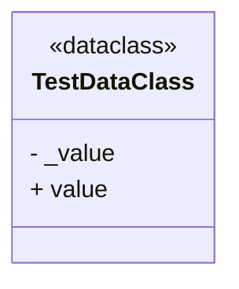

# TestClass
This is a test class.

```mermaid
classDiagram
    class TestClass {
- _private_var
+ public_var
- _private_var
+ public_var
- __init__()
- _privatemethod()
+ publicmethod()
}
```

# TestDataClass
No documentation provided.

```mermaid
classDiagram
    class TestDataClass {
<<dataclass>>
- _value
+ value
}
```
