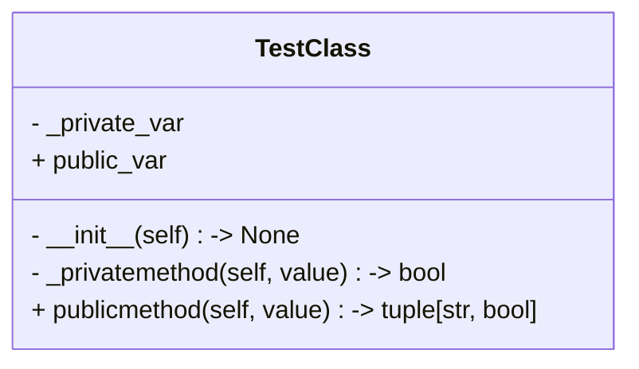
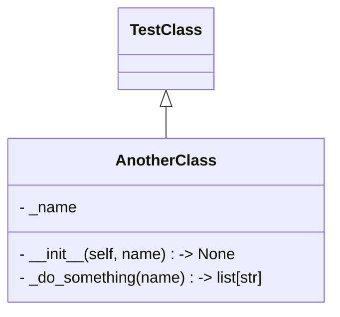
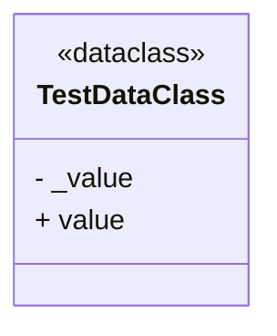

# TestClass
This is a test class.

```mermaid
classDiagram
    class TestClass {
- \_private\_var
+ public_var
- \_\_init\_\_(self) -> None
- \_privatemethod(self, value) -> bool
+ publicmethod(self, value) -> tuple[str, bool]
}
```

# AnotherClass
Its just a class with inhertation.
[Parent class](#testclass)

```mermaid
classDiagram
TestClass <|-- AnotherClass
    class AnotherClass {
- \_name
- \_\_init\_\_(self, name) -> None
- \_do\_something(name) -> list[str]
}
```

# TestDataClass
This is a docstring.

```mermaid
classDiagram
    class TestDataClass {
<<dataclass>>
- \_value
+ value
}
```
