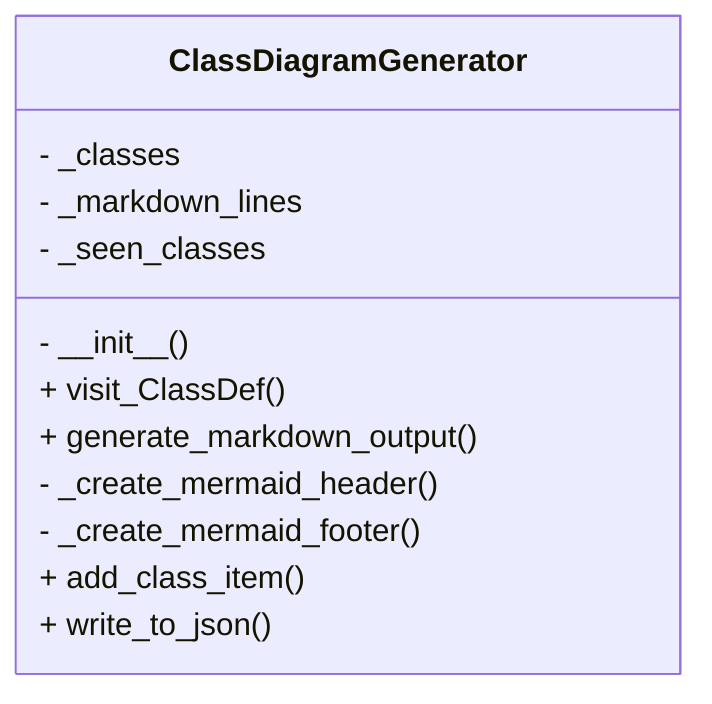
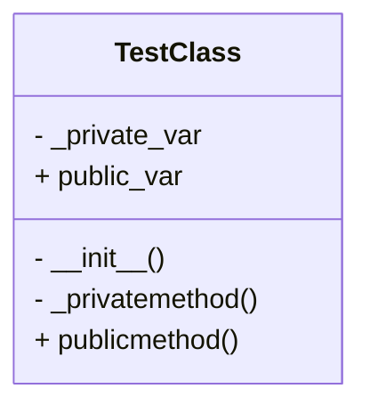
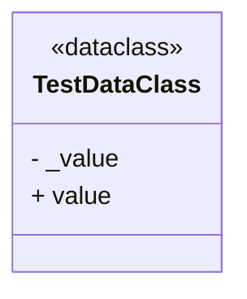

# ClassDiagramGenerator
Generator class for UML-Diagramm generation.

```mermaid
classDiagram
    class ClassDiagramGenerator {
- \_classes
- \_markdown\_lines
- \_seen\_classes
- \_\_init\_\_()
+ visit_ClassDef()
+ generate_markdown_output()
- \_create\_mermaid\_header()
- \_create\_mermaid\_footer()
+ add_class_item()
+ write_to_json()
}
```

# TestClass
This is a test class.

```mermaid
classDiagram
    class TestClass {
- \_private\_var
+ public_var
- \_\_init\_\_()
- \_privatemethod()
+ publicmethod()
}
```

# TestDataClass
This is a docstring.

```mermaid
classDiagram
    class TestDataClass {
<<dataclass>>
- \_value
+ value
}
```
