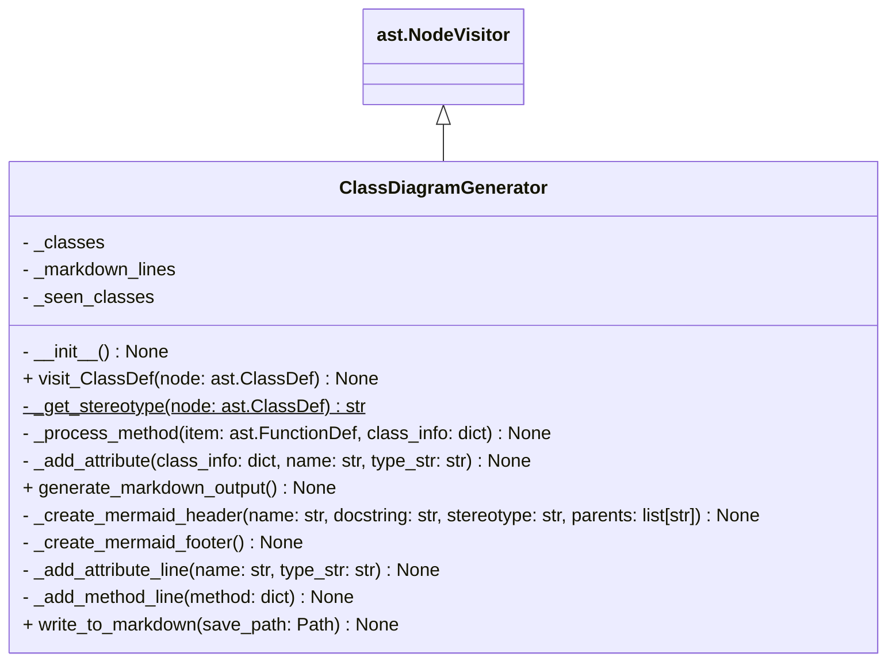

# ClassDiagramGenerator
Generator class for UML-Diagramm generation.
Parent class: ast.NodeVisitor

```mermaid
classDiagram
ast.NodeVisitor <|-- ClassDiagramGenerator
    class ClassDiagramGenerator {
- \_classes
- \_markdown\_lines
- \_seen\_classes
- \_\_init\_\_() None
+ visit\_ClassDef(node: ast.ClassDef) None
- \_get\_stereotype(node: ast.ClassDef) str $
- \_process\_method(item: ast.FunctionDef, class_info: dict) None
- \_add\_attribute(class_info: dict, name: str, type_str: str) None
+ generate\_markdown\_output() None
- \_create\_mermaid\_header(name: str, docstring: str, stereotype: str, parents: list[str]) None
- \_create\_mermaid\_footer() None
- \_add\_attribute\_line(name: str, type_str: str) None
- \_add\_method\_line(method: dict) None
+ write\_to\_markdown(save_path: Path) None
}
```
