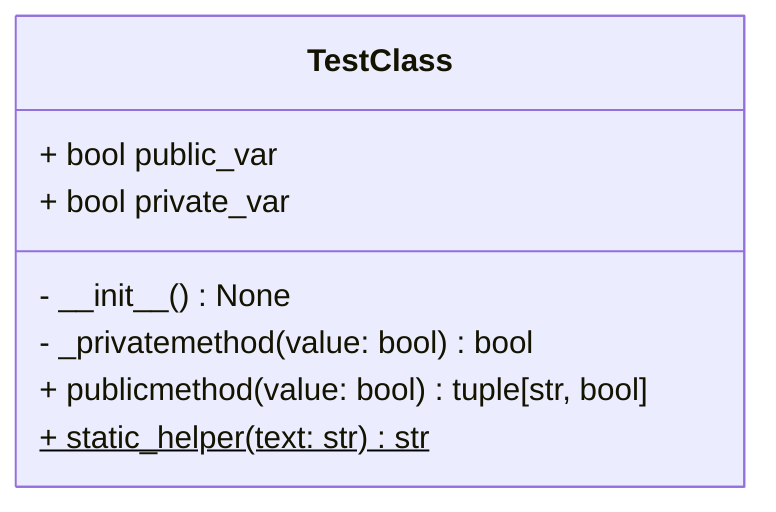
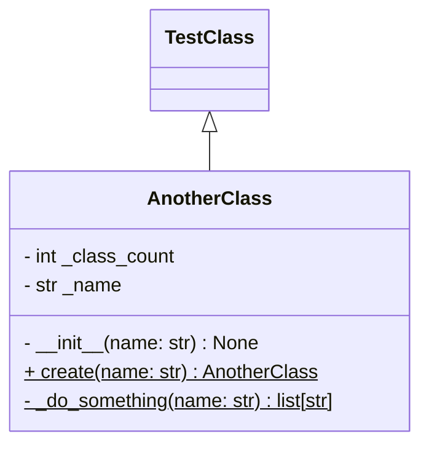
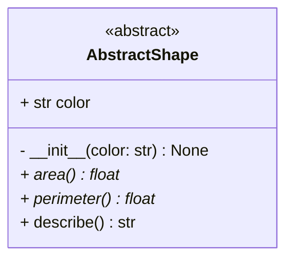
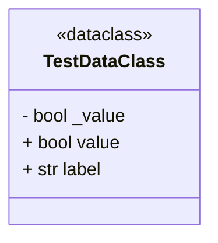
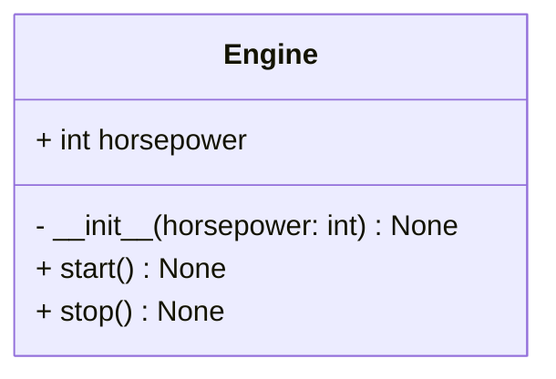
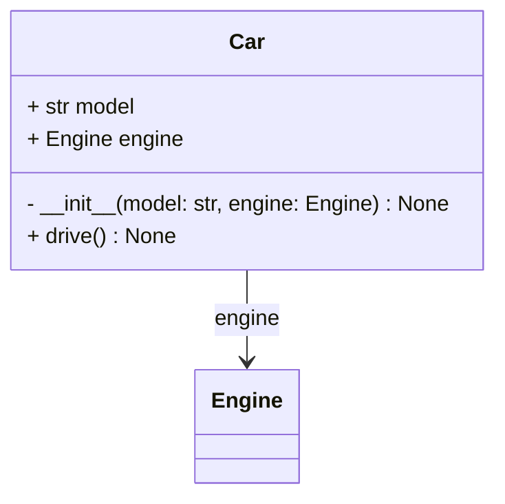

# TestClass
This is a test class.

# AnotherClass
Its just a class with inhertation.
[Parent class](#testclass)

# AbstractShape
Abstract base class for shapes.

# TestDataClass
This is a docstring.

# Engine
Represents a car engine.

# Car
A car that uses an Engine — demonstrates association traceability.
[Uses](#engine)

